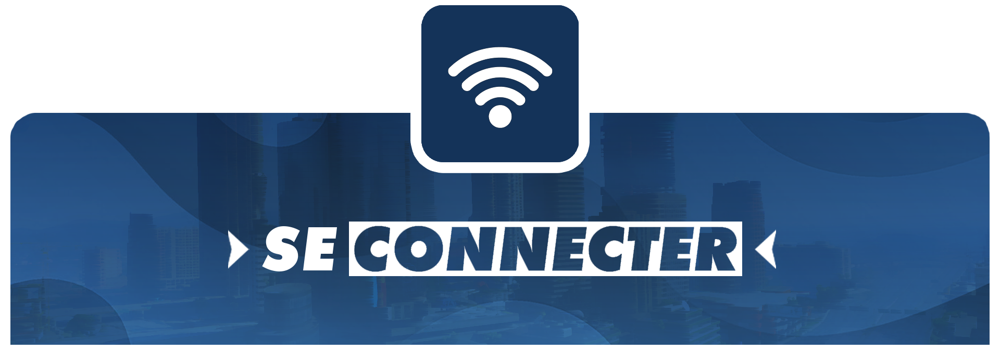

# 🔌 Connexion

<figure><figcaption></figcaption></figure>

## Première méthode

* Cliquez sur <mark style="color:red;">**Jouer**</mark>
* Ensuite, rechercher <mark style="color:red;">**Valestia**</mark> dans la liste des serveurs FiveM.
* Puis cliquez sur <mark style="color:red;">**Valestia**</mark>, enfin vous pouvez vous connecter.

## Deuxième méthode

* Appuyez sur <mark style="color:red;">**F8**</mark> dans le menu FiveM, puis collez ceci dans la console ->\
  **connect** [<mark style="color:red;">**https://**</mark>](https://play.astrarp.net/)<mark style="color:red;">**cfx.re/join/xjg38r**</mark>
* Appuyez sur <mark style="color:red;">**ENTRER**</mark> et vous voilà en cours de connexion à notre serveur !
