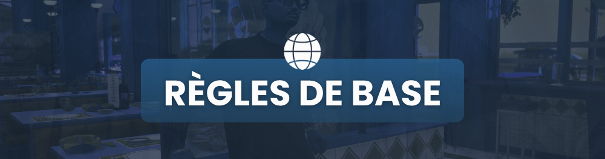

# Règles de base

<figure><figcaption></figcaption></figure>



* Le **langage/vocal HRP** est <mark style="color:red;">interdit</mark>. Vous ne devez utiliser que des termes cohérents, comme si votre personnage était dans la vraie vie.
* Les **insinuations HRP** sont <mark style="color:red;">interdites</mark>. (_ex: Utiliser le mot "papillon" pour désigner un staff ou encore la phrase "je vais dans ma tête" pour dire que vous allez vous déconnecter)._ Les insinuations ne sont pas des erreurs graves, mais ce sont des erreurs qui enlaidissent considérablement les scènes.
* La **double vocale** est <mark style="color:red;">strictement interdite</mark>. Une fois en jeu, vous ne devez être connecté à aucun autre système de chat vocal que celui proposé IG (téléphone, radio, etc).
* <mark style="color:red;">Aucun</mark> modificateur de voix n'est autorisé.
* Parler en étant dans le **coma** est <mark style="color:red;">interdit</mark>.
* Le racisme, l'homophobie, et tous les autres propos/gestes **à visée** **discriminatoire** sont <mark style="color:red;">interdits</mark>.
* Le free punch, free shoot, free kill, car kill sont bien entendus <mark style="color:red;">interdits</mark>.
* Le power gaming et le meta gaming sont <mark style="color:red;">interdits</mark>.
* L'utilisation de glitchs/bugs est <mark style="color:red;">strictement interdit</mark>. Il est <mark style="color:blue;">obligatoire</mark> de les faire remonter via ticket Discord si jamais vous en rencontrez.
* Le RP sexe et le RP viol sont <mark style="color:red;">strictement</mark> <mark style="color:red;">interdits</mark>.
* Les arnaques sont <mark style="color:red;">interdites</mark>.
* Votre **tenue** doit être **cohérente**. Ne vous baladez pas en sous-vêtements dans la rue, ne soyez pas pieds-nus, etc.
* Porter un masque ou gilet par-balle **sans raison valable** est <mark style="color:red;">interdit</mark>.
* **Changer de tenue** en pleine scène est <mark style="color:red;">interdit</mark>, sauf si vous faites ça de manière cohérente : sortir la tenue d'un sac/d'un véhicule et/ou avec un /me.
* Les **/me** sont <mark style="color:blue;">autorisés seulement</mark> pour **décrire une action RP**.
* Discerner l'_argent **propre**_ de l'_argent **sale**_ à l'œil nu est <mark style="color:red;">interdit</mark>.
* **Sauvegarder ses biens** _(argent, armes, items, etc)_ via un coffre ou un joueur pour ensuite les récupérer après un wipe est <mark style="color:red;">strictement interdit</mark>.
* Spam une emote est <mark style="color:red;">interdit</mark>.



* Le background de votre personnage <mark style="color:blue;">doit être cohérent</mark>.
* Votre personnage doit être **inventé** de toutes pièces. Il est <mark style="color:red;">interdit</mark> de reprendre le nom et prénom de personnalités publiques.
* <mark style="color:red;">Interdiction</mark> de créer un personnage qui **existe déjà** ou qui a été **wipe** sur le serveur (sauf dérogation staff).



* Il est <mark style="color:blue;">obligatoire</mark> de **rouler de manière cohérente** : _ne pas rouler sur les trottoirs, ne pas rouler en plein centre ville à 200 km/h, etc_. Ces règles ne s'appliquent pas si vous êtes en course poursuite bien entendu.
* Les **pits** sont <mark style="color:red;">interdits</mark>.
* **Porter** un joueur **en conduisant** un véhicule est <mark style="color:red;">interdit</mark>.
* **Porter** un joueur **en étant sur une moto** est <mark style="color:red;">interdit</mark> _(que vous soyez conducteur ou non)_.
* S'il n'y a **plus de place** dans votre véhicule, vous ne pouvez porter qu'au <mark style="color:blue;">maximum 1 personne en plus</mark> _(en RP vous faites comme si elle était au milieu de la banquette arrière)_.
* Pour les **4 roues** :
  * 1 pneu crevé = rouler max à 50km/h.
  * 2 pneus crevés ou plus = arrêt du véhicule.
* Pour les **2 roues** : 1 pneu crevé ou plus = arrêt du véhicule.
* <mark style="color:red;">Interdiction</mark> de **rouler sur les montagnes** (hors-sentiers) quelque soit le véhicule _(non les véhicules off-road ne sont pas faits pour ça)_.
* <mark style="color:red;">Interdiction</mark> de rouler sur les sentiers off-road en montagn&#x65;**,** sauf si vous êtes en véhicule off-road.



* **Contester un jail** est <mark style="color:blue;">autorisé</mark> seulement si vous êtes sûr à 100% que vous n'êtes pas en tort ou que la sanction n'est pas du tout appropriée.
* Le jail est un **environnement HRP**, il est donc <mark style="color:red;">strictement interdit</mark> de communiquer avec des personnes en RP (téléphone, radio, etc). La double vocale n'est toujours pas autorisée en jail sauf si c'est pour contester la sanction en BDA.




<mark style="color:red;">**ON NE RÉPOND PAS AU HRP PAR LE HRP !**</mark>\
Si vous rencontrez un joueur qui ne respecte pas le règlement, prenez son ID et un rec si possible, puis contactez un staff. Si vous rentrez dans son jeu et que vous faites vous aussi des actions HRP, vous risquez très certainement d'être sanctionné(e) aussi !

