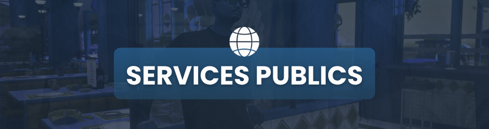

# Services Publics

<figure><figcaption></figcaption></figure>

Respect des services publics

* Déconnexion lors d'une scène avec les services publics : il est interdit de se déconnecter lors d'une scène impliquant les services publics. Cela permet de maintenir la continuité du jeu.
* Discord des services publics : tous les serveurs Discord des services publics doivent être sous la propriété du fondateur du serveur pour assurer la coordination et la gestion appropriées.

Relation avec le gouvernement

Interdiction envers le gouvernement : il est strictement interdit de braquer un membre du gouvernement, car ils sont des représentants de l'autorité en jeu. De plus, toute attaque contre les membres du gouvernement nécessite une approbation préalable du staff.

Relation avec la police

* Respect envers la police : le fear envers la police doit être maintenu en toutes circonstances.
* Interdictions lors d'interaction avec la police : il est interdit de faire du "copbait", de perturber les courses-poursuites, de détruire vos biens ou de retourner dans votre quartier pendant une course-poursuite.
* Autres règles concernant la police : lorsque la police arrive sur une scène illégale, la meilleure réaction est de fuir. Il est également interdit de fuir dans l'eau pour échapper à une scène avec la police.
* Utilisation judicieuse de la prise d'otages : En général, il est recommandé de ne pas prendre en otage la police, car cela peut entraîner des conséquences RP graves, telles que le niveau d'alerte "[defcon](https://wiki.astrarp.net/astrarp/reglement-astra/reglement-legal/reglement-sasp/defcon)"
* Spam les appels via le téléphone sont passibles d'une sanction.

Prise d'otage des policiers

* Conditions pour braquer un policier : il est interdit de braquer un policier en service, sauf dans certaines situations spécifiques, telles que la sécurisation des leads, les attaques de convois de fonds.
* Utilisation judicieuse : en général, il est recommandé de ne pas prendre en otage la police, car cela peut entraîner des conséquences RP graves, telles que le niveau d'alerte "defcon", des perquisitions, des descentes, grosses amendes, mise en fédérale (_<mark style="color:red;">WIPE</mark>_), etc. Cette règle vise à maintenir un équilibre dans les interactions entre les groupes illégaux et les forces de l'ordre sur le serveur.

Relation avec les EMS

* Respect envers les EMS : Il est strictement interdit de kidnapper ou de tirer sur un EMS en service. _**En cas de scène en cours, style GF, vous pouvez braquer l'EMS uniquement pour lui dire de partir.**_
* <mark style="color:red;">En cas de fin de scène, vous ne pouvez pas bloquer les EMS sur les réanimations</mark>.
* Les ATA sont non négociable, il est interdit de braquer un EMS pour lui demander de retirer l'ATA, sachant que l'ATA est obligatoire après une mort.
* Respect du MassRP à l'hôpital : vous devez respecter le MassRP à l'hôpital en respectant les autres joueurs présents.
* Vous ne pouvez pas modifier un ATA en cours mis par un EMS, en cas de modification, une sanction type jail ou ban perm pourra être appliqué.
* Il est interdit de déplacer les corps pour éviter que les EMS ne retrouve pas l'endroit de l'intervention pour laquelle ils ont été appelée.
* Spam les appels via le téléphone sont passibles d'une sanction.

Relation avec les entreprises

Interdictions envers les entreprises : il est strictement interdit de braquer sur les lieux des entreprises, considérés comme des zones safes. Le braquage d'un magasin LTD occupé par un joueur en tant qu'employé est également interdit, tout comme prendre en otage des employés d'une entreprise pendant leur service.

