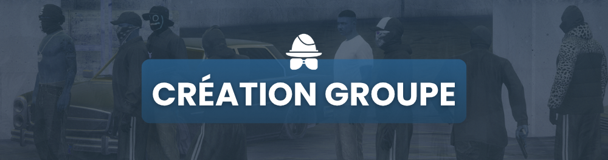

# Création Groupe

<figure><figcaption></figcaption></figure>

_Afin de créer votre groupe illégal, il vous faut tout d'abord constituer un dossier puis ensuite ouvrir un ticket dans la catégorie illégal sur le discord Astra._

### 🔥 **1. Présentation du Groupe**

* Nom du groupe : **\[Nom du groupe]**
* Type de groupe : **(Gang, Club de motards, Organisation criminelle, etc.)**
* Histoire et origines : **(Expliquez comment et pourquoi votre groupe a été créé, son évolution et ses valeurs principales.)**
* Hiérarchie et rôles : **(Décrivez les grades au sein du groupe et leurs responsabilités.)**

### 🏴 **2. Vision du RP Illégal**

* **Philosophie du groupe** : **(Expliquez comment vous souhaitez développer votre RP illégal sur le serveur.)**
* **Code d’honneur ou règles internes** : **(Y a-t-il des valeurs spécifiques respectées par le groupe ?)**
* **Approche du RP** : **(Privilégiez-vous la diplomatie, la violence, l’infiltration ?)**
* **Lien avec d’autres factions** : **(Avez-vous des alliances ou des conflits en cours ?)**

### 📸 **3. Photos des Tenues**

* **Présentation des tenues officielles et alternatives.**
* **Code vestimentaire (accessoires, couleurs dominantes, logos, etc.).**

### 🚗 **4. Présentation des Véhicules**

* **Liste des véhicules principaux et secondaires utilisés par le groupe.**
* **Pourquoi ces véhicules sont-ils choisis ? (Aspect RP, rapidité, discrétion, intimidation, etc.).**
* **Photos des véhicules avec des mises en scène RP.**

### 🎯 **5. Objectifs et Apport au Serveur**

* **Objectifs à court terme** : **(Exemple : prise de territoire, alliances, montée en puissance, etc.)**
* **Objectifs à long terme** : **(Influence sur le serveur, contrôle d’activités criminelles, etc.)**
* **Ce que vous apportez au RP du serveur** : **(Un style de jeu unique, des interactions de qualité, etc.)**

### 🏠 **6. Localisation du QG**

* **Description du quartier ou du lieu choisi.**
* **Pourquoi ce choix ?**
* **Photo du QG avec une mise en scène RP.**

### 🗣 **7. Lexique du Groupe**

* **Expressions et codes de langage spécifiques.**
* **Culture et jargon du groupe (ex. : biker, gang latino, mafia, etc.).**

### 📌 **8. Membres du Groupe**

* **Liste des membres (minimum 15 personnes).**
* **Précision des rôles pour chacun.**
