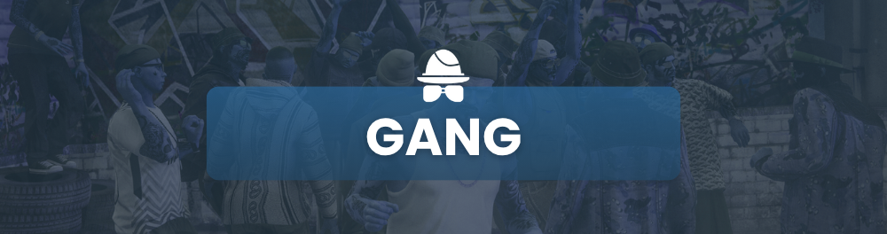

# Gang

<figure><figcaption></figcaption></figure>

Les Gangs doivent impérativement respecter leur lore, leur identité visuelle et leur charte esthétique, y compris les vêtements, les couleurs et autres éléments distinctifs.


La limitation dans un gang est de 25 personnes maximum.


Les gangs ont la possibilité de reprendre uniquement des LTD.

Armes

<mark style="color:blue;">**Information**</mark>

Pour sortir une arme lourde, la personne doit porter un sac correspondant ou le sortir d'un coffre d'un véhicule, <mark style="color:blue;">**vous vous soumettez au risque de vous la faire prendre**</mark>**. Si vous portez un sac invisible.**

<mark style="color:blue;">**Gangs**</mark>

* Maximum **1 fusil à pompe**
* Maximum **2 armes automatiques**
* Maximum **1 arme lourde** sortie simultanément lors des opérations (OP).

Rançons

<mark style="color:blue;">**Rançon en argent sale**</mark>

* **Bas gradé** : 10.000$ d’argent sale
* **Gradé / Leader** : 25.000$ d’argent sale

<mark style="color:blue;">🔹</mark> <mark style="color:blue;">**Conditions**</mark> <mark style="color:blue;">:</mark>

* La rançon ne peut être exigée que si la victime est toujours en vie.

Véhicules

<mark style="color:blue;">**Utilisation des véhicules**</mark>

* Tous les véhicules, à l'exception des véhicules tout-terrain, sont interdits en montagne.
* L'utilisation de véhicules blindés est <mark style="color:red;">STRICTEMENT INTERDITE.</mark>
* Il est <mark style="color:red;">FORMELLEMENT INTERDIT</mark> d'utiliser ou de remonter dans un véhicule en plein gunfight. Aucun retour sur la scène n'est autorisé après une élimination.
* Percuter intentionnellement un joueur dans le but de l'éliminer ensuite est interdit.

<mark style="color:blue;">**Convois**</mark>

* Un convoi peut contenir un maximum de **7 véhicules** (6 + 1 véhicule de backup).
* Les organisations sont limitées à **2 véhicules importés** dans leur convoi.

