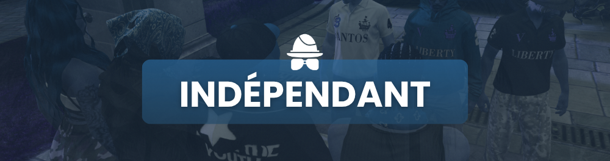

# Indépendant

<figure><figcaption></figcaption></figure>


La limitation dans un groupe indépendant est de 10 personnes maximum.


<mark style="color:red;">Interdiction</mark> pour tout indépendant de braquer, extorquer ou attaquer un groupe officiel.

Aucun indépendant n'est autorisé à être sur un point de drogue a part si ils sont missionner par un groupe officiel. Les points de drogue sont réservés aux groupe officiels. Chaque personne indépendante se voit mise sous risque de mort RP.

Un groupe indépendant ne peut pas revendiquer un quartier ou un territoire.
