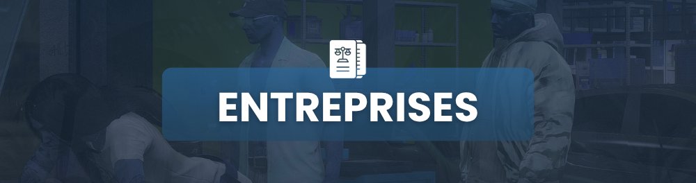

# Entreprises

<figure><figcaption></figcaption></figure>


<mark style="color:red;">**Le nombre d’employés maximal est de 30 personnes.**</mark>




* Il est <mark style="color:red;">**INTERDIT**</mark> pour les patrons de se servir dans le coffre de l’entreprise à des fins personnelles.
* Les entreprises hors boutique sans activité patronale pendant 1 semaine seront récupérées et remises sous dossier. (hors absence prévenue)
* Il est totalement <mark style="color:red;">**INTERDIT**</mark> de vendre/donner son entreprise. Si vous ne souhaitez plus gérer votre entreprise, vous devez faire un ticket et celle-ci sera remise sous dossier.
* Le FISC est obligatoire pour les entreprises déclarées. Tout manquement entraînera des sanctions RP et HRP.
* Un patron ne peut être patron que d’une seule et unique entreprise.
* Un chef d’entreprise doit fournir une raison valable pour un licenciement.



* Il est <mark style="color:red;">INTERDIT</mark> de vendre des véhicules d’entreprises, SAMS, SASP ou gouvernement sans vérification auprès d’un admin du statut de la personne en HRP.
* Il est <mark style="color:red;">INTERDIT</mark> d’attribuer gratuitement des véhicules à ses amis. Toute personne voulant un véhicule est dans l’obligation de le payer.



* Il est <mark style="color:red;">**INTERDIT**</mark> d’installer des armes sur les véhicules pouvant les recevoir ainsi que le blindage.
* Il est <mark style="color:red;">**INTERDIT**</mark> d’utiliser vos permissions en dehors de votre service.\
  \&#xNAN;_<mark style="color:orange;">**Exemple : déverrouiller une voiture pour la voler.**</mark>_
* Il est <mark style="color:red;">**INTERDIT**</mark> de usebug pour raccourcir l'animation de réparation ou autre.



* Il est <mark style="color:red;">INTERDIT</mark> de se servir dans le coffre de l’entreprise pour sa consommation personnelle en dehors d’un accord préalable avec la direction de l’entreprise.



* Elle peut s'obtenir via un dossier ou via la boutique.
* Si une entreprise est acquise via la boutique, elle est considérée comme un **achat boutique** et restera donc la propriété de son acheteur en cas de wipe. Toutefois, l’entreprise devra obligatoirement modifier son statut (nom, emplacement, etc.). L’équipe staff se réserve également le droit de retirer l’entreprise après **5 avertissements**.


