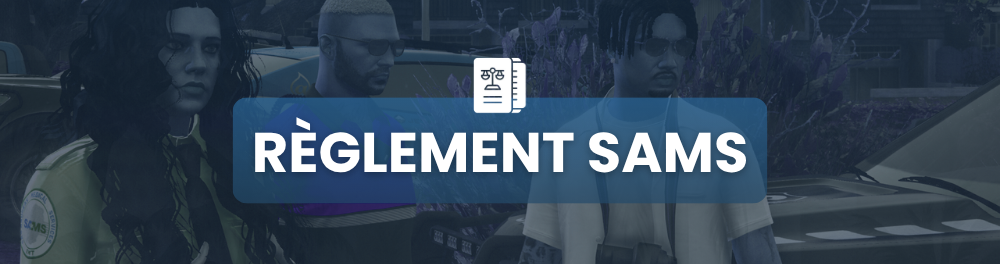

# Règlement SAMS

<figure><figcaption></figcaption></figure>




*   <mark style="color:blue;">Accès aux Quartiers</mark>

    Un SAMS peut intervenir dans un quartier uniquement si une autorisation lui a été accordée par un responsable désigné. Une autorisation permanente peut être accordée pour certaines zones spécifiques, notamment les quartiers sous surveillance renforcée. Dans des situations d'urgence extrême (danger vital, pandémie, catastrophe), un SAMS peut recevoir une autorisation exceptionnelle pour accéder aux zones restreintes.
*   <mark style="color:blue;">Soins et Assistance</mark>

    En cas de refus de soins par un individu conscient et juridiquement capable, le SAMS doit respecter cette décision sauf en cas de danger immédiat pour la vie de la personne ou d’autrui.
*   <mark style="color:blue;">Application d'une ATA (Assistance Temporaire Automatisée)</mark>

    Un SAMS est autorisé à appliquer une ATA d’une durée de 10 minutes si la situation le justifie (ex. : crise, nécessité de contention médicale, évaluation d’un état critique). Dans certains cas exceptionnels, la durée de l’ATA peut être prolongée avec validation d’un superviseur humain ou d’un protocole de contrôle avancé. L’ATA ne peut être utilisée qu’en dernier recours si d’autres méthodes sont jugées inefficaces ou inap
*   <mark style="color:blue;">Limites et Responsabilité</mark>

    Toute intervention d’un SAMS doit être enregistrée et tracée pour assurer une transparence et un suivi en cas de litige. Un citoyen peut contester une intervention ou une décision d’un SAMS via une procédure dédiée, impliquant un examen par un comité indépendant. Les SAMS sont soumis à des protocoles éthiques stricts pour éviter toute utilisation abusive ou disproportionnée de leurs capacités.
* <mark style="color:blue;">Règles Spécifiques</mark>
  * Ne pas intervenir sur une scène de GF pour réanimer les joueurs => une fois le GF complètement terminé, attendre minimum 5 minutes pour intervenir.
  * Interdiction de soigner une personne sans être en service + tenue.
  * Interdiction de donner/jeter/vendre des items d'EMS (medit kit, etc).
  * Port du masque (sauf masque de chirurgie en salle d'opération) interdit en service.
  * Tous les items doivent être déposés à l'hôpital à la fin de votre service. \{% endtab %\}



* Il est strictement <mark style="color:red;">**INTERDIT**</mark> pour les membres de la direction (directeur, co-directeur et directeur des ressources humaines) de faire de l’illégal.
* Il est formellement <mark style="color:red;">**INTERDIT**</mark> de donner/vendre les matériels SAMS (médikits, bandages, chaises roulantes & brancards)
* Il est <mark style="color:red;">**INTERDIT**</mark> d’intervenir durant une fusillade, veuillez attendre la fin de cette dernière pour intervenir.
* Vous n’avez pas le droit d’utiliser votre service SAMS en faisant de l’illégal. (Pour soigner/réanimer un personnage.)
* Il est <mark style="color:red;">**INTERDIT**</mark> de usebug pour raccourcir l'animation de soin ou de réanimation sous peine de sanction.
* Il est <mark style="color:red;">**INTERDIT**</mark> de garder le service SAMS une fois que la tenue est enlevé.



* La tenue de service est obligatoire, tout comme l’utilisation d’un véhicule approprié et sérigraphié SAMS .


