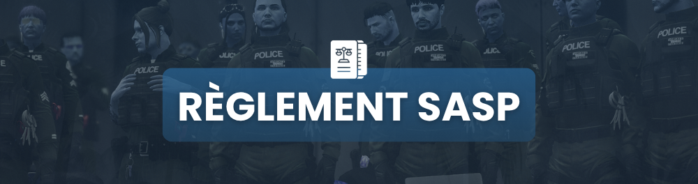

# Règlement SASP

<figure><figcaption></figcaption></figure>



**Manœuvres en Course-Poursuite**

* Faire les pneus est autorisé **seulement si** :
  * Les occupants du véhicule en fuite ont eux-mêmes tenté de crever les pneus d'un véhicule des forces de l'ordre.
  * Les occupants du véhicule en fuite ont ouvert le feu sur un agent ou un civil.
* **Les PITs sont interdits.**

**Interventions sur les Points de Drogue**

* 1 descente par semaine et par point de drogue maximum.
* Un dossier d'intervention est obligatoire avant chaque descente.
* En cas de fusillade sur un point de drogue, la SASP doit recueillir des informations afin de constituer un dossier de descente.

**Surveillance des Zones Sensibles**

* La SASP peut patrouiller aux abords des zones de gang et des villas.
* Toute intervention dans ces zones doit être justifiée par une raison urgente et valable.
* **Fear illégal** : Interdiction de rentrer dans les quartiers des gangs sans raison urgente.

**Gestion des Objets Saisis**

* Tout objet saisi doit être déposé dans les saisies officielles.
* Il est **interdit** de garder un objet saisi sur soi.

**Gestion des Suspects en Incapacité**

* Les agents de la SASP peuvent menotter une personne en état d'incapacité (coma, KO, etc.) **uniquement si elle représente un danger pour la sécurité des personnes aux alentours.**
* **Interdiction de fouiller ou looter une personne en coma.**

**Interdictions en Service**

* **Interdiction de faire un retour au poste de police si vous êtes poursuivi.**
* **Interdiction de contrôler ou fouiller un joueur sans être en service et en tenue officielle.**
* **Interdiction d'utiliser un véhicule de police en dehors du service.**
* **Interdiction de donner, jeter ou vendre une arme de police.**

**Armement Autorisé**

* Les seules armes autorisées en service sont celles fournies par l'armurerie.
* Les agents de la SASP peuvent utiliser les armes suivantes :
  * Glock 17
  * HK UMP
* L'État-major est autorisé à utiliser le Scar-H17.

**Usage de la Force et des Armes à Feu**

* **L'utilisation de la force est autorisée uniquement après 3 sommations.**
* **Les tirs ne sont autorisés que si un individu représente une menace immédiate pour la vie d'un agent ou d'un civil.**
* L’usage d’armes à feu doit être justifié par la légitime défense ou une riposte proportionnée.

**Fouilles Autorisées**

* Une fouille est autorisée uniquement si l’individu :
  * Est masqué.
  * Est monté dans un véhicule de police.
  * Porte un holster ou un GPB.
  * Possède une arme apparente.
  * Commet un délit de fuite.
  * **Si le DEFCON l’autorise.**

**Comptabilisation des Effectifs**

* **1 agent de police compte pour 2.**

**Accès à l'Illégalité**

* **Obligation de passer par un wipe pour faire de l'illégal, sauf dérogation exceptionnelle.**


